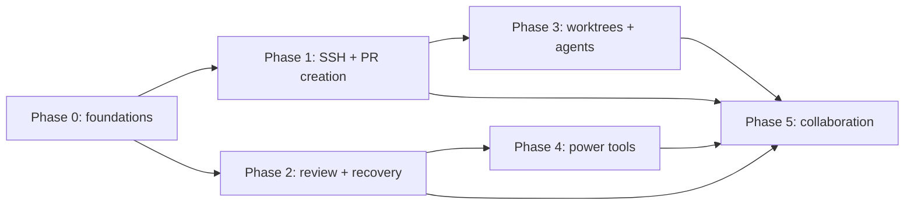

# Multi-Git Feature Roadmap

This directory turns the competitive review into independently executable implementation phases. Each phase is a self-contained handoff for a coding agent, while [FEATURE_PARITY.md](FEATURE_PARITY.md) is the shared inventory and research record.

## Product decisions

- Pull requests use a large in-app creator, with GitHub implemented first through the authenticated `gh` CLI and a provider interface retained for later hosts.
- SSH profiles use the native Windows OpenSSH Authentication Agent. When a selected key is unlocked, Multi-Git starts or repairs the agent when needed and loads that key. Other operating systems receive detection and actionable diagnostics first.
- Worktrees are first-class and can launch configured external coding agents. Multi-Git does not inject proprietary hooks or attempt to monitor live agent sessions.
- Git commands remain argument-array based. Never interpolate untrusted values into a shell command, log secrets, or weaken repository path validation.
- Dependency upgrades target the newest stable releases. If compatibility cannot be restored with reasonable changes, pin the newest compatible release and document the exact blocker and upstream issue.

## Phases

| Phase | Deliverable | Depends on | Parallel work | Status |
| --- | --- | --- | --- | --- |
| [0](phase-0-toolchain-foundations.md) | Latest toolchain, cancellable process runner, schemas and CI foundations | None | Must land first | Complete (2026-08-05) |
| [1](phase-1-ssh-agent-pr-creator.md) | Reliable SSH agent integration and GitHub PR creator | Phase 0 | SSH and PR lanes can split | Complete (2026-08-07) |
| [2](phase-2-review-history-recovery.md) | Precision review, history rewriting, signing and recovery | Phase 0; signing follows Phase 1 SSH | Feature lanes can split | Complete (2026-08-08) |
| [3](phase-3-worktrees-windows-agents.md) | Worktrees, multi-window workflows and external agent launch | Phase 1 | Can run beside Phase 2 or 4 | **Ready to start** |
| [4](phase-4-repository-power-tools.md) | Remotes, submodules, LFS, patches, bisect, notes and external tools | Phase 2 recovery primitives | Can run beside Phase 3 | **Ready to start** |
| [5](phase-5-collaboration-stacked-work-environments.md) | Multi-provider collaboration, stacked work, WSL and remote environments | Phases 1–4 | Split by provider/environment | Blocked on Phases 3–4 |

Phase 2 is done, which unblocks Phase 4 — its recovery primitives were the
dependency. **Phases 3 and 4 are now both startable and can run in parallel**:
3 is worktrees, windows and agent launch, 4 is remotes, submodules, LFS,
patches, bisect and notes, and they share no hotspot beyond the ones listed in
the execution contract below.



## Current state

Phases 0 and 1 are merged into `improvements`, which is the integration branch
for this programme. `main` is untouched since the work began; a single
`improvements` → `main` pull request closes it out once every phase has landed.

| | |
| --- | --- |
| Integration branch | `improvements` |
| Merged | [#14](https://github.com/AnthonyKopri/multi-git/pull/14) (Phase 0), [#15](https://github.com/AnthonyKopri/multi-git/pull/15) (Phase 1) |
| Awaiting review | Phase 2, on `claude/roadmap-version-display-e8d226` |
| Suite | 769 passed, 3 skipped |
| Toolchain | Electron 43.3.0, TypeScript 7.0.2, Vitest 4.1.10, Node ≥ 22.12 |
| CI | 7 jobs — Windows and Linux on Node 22.12 and 24, a leg with no `gh` and no SSH agent, docs, packaging smoke |
| `npm audit` | 0 vulnerabilities |

### Foundations later phases should build on, not rebuild

Phase 0 and 1 exist so that Phases 2–5 do not each invent these. Reach for them
before writing anything similar.

| Need | Use | Notes |
| --- | --- | --- |
| Run any external program | `src/server/process/runner.ts` | Injectable, argv-only, no shell. Cancellation kills the whole process tree. Redacts secrets from stdout, stderr *and* the recorded argv. |
| Show or cancel long work | `src/server/operations/registry.ts` | States, SSE stream, cancel endpoint. **No UI yet** — that is Phase 4. |
| Change persisted config | `src/server/config/migrations.ts` | Versioned, idempotent, atomic. Needs a fixture for the version it upgrades from. |
| Identify a repository | `src/server/config/repo-identity.ts` | Canonical key: resolves links, trailing separators, Unicode form, and case where the filesystem folds it. Never use a display path as a key. |
| Add a code host | `src/shared/provider-types.ts`, `src/server/providers/` | `HostingProvider` contract with GitHub as the only implementation. |
| SSH identity for an operation | `src/server/ssh/agent-session.ts` | `ensureAgentForRepo` before any network call. Signing (Phase 2) should reuse this state model rather than its own. |
| Read a diff as structure, not text | `src/server/git/structured-diff.ts` | Keeps header lines verbatim and gives each hunk a content-derived id. Commit and rebase views should parse with this, not a second parser. |
| Apply part of a diff | `src/server/git/patch-build.ts`, `src/server/git/precision-staging.ts` | Selection → patch → `git apply` over stdin. Commit splitting (Workstream D) is this plus a reset. |
| Diff two lines by word | `src/renderer/features/diff/word-diff.ts` | Token LCS plus removal/addition pairing. Pure and testable; reuse it for any other side-by-side view. |
| Read a file's bytes at a revision | `src/server/git/blob.ts` | Raw bytes, not decoded text. Image comparison and binary sizes both come from here. |
| Show the version | `appVersion()` / `appTitle()` in `src/server/app-root.ts` | Reads the packaged package.json once. Window titles use it directly; the browser tab gets it from `GET /api/app-info`. |
| Record a destructive operation | `captureCheckpoint` in `src/server/safety-net/checkpoints.ts` | Writes the session undo *and* the durable recovery point. Pass an `operation`; never write to one store alone. |
| Read git's own recovery record | `src/server/git/reflog.ts` | Newest first, with each entry's previous position resolved. |
| Answer an editor git insists on opening | `src/server/git/rebase-bridge.ts` | Fixed script, mode as an argument, payload by environment. Any future `git commit --interactive` or `filter-branch` work should reuse it rather than invent a second one. |
| Sign, or read a signature | `src/server/git/signing.ts` | Also the place that knows `%G?` = N is ambiguous. |
| Test something that shells out | `tests/helpers/fake-runner.ts` | Scripted responses plus argv/stdin/env assertions. No `gh`, agent, key or network anywhere in the suite. |
| Test renderer behaviour | `// @vitest-environment happy-dom` | Mount the real `public/index.html`, so a renamed element id fails the suite. See `tests/pull-request-window.test.ts` and `tests/diff-selection.test.ts`. |

### Open follow-ups carried forward

None of these block Phase 3 or Phase 4. They are listed so they are not
rediscovered as surprises. Details and evidence are in
[FEATURE_PARITY.md](FEATURE_PARITY.md#open-follow-ups).

1. **Express 5** — the one dependency not at latest. Nothing blocks it; it was
   left out of Phase 0 as a runtime-framework major touching every route file.
2. **Repository paths outside Latin-1 cannot be opened** — a pre-existing
   defect in how `x-repo-path` is transported. `café` works, `中文` and emoji
   do not.
3. **Operation progress has no UI** — the server side landed in Phase 0 and
   Phase 2 registers diff reads through it, so the work to cancel is tracked
   and the runner takes an AbortSignal. The panel that would let a user press
   cancel is Phase 4's.
4. **Never manually exercised** — creating a real pull request, and the fork
   workflow. Both are covered against a scripted `gh`.
5. **GPG signing is untested against a real keyring.** Phase 2's suite signs
   with SSH, which needs neither an agent nor a keyring; the GPG path is
   covered only for configuration and diagnostics.
6. **`git rebase -i` hits Windows MAX_PATH** in a repository whose path is long
   enough that git's internal range filename exceeds 260 characters. Git's own
   limit, reproducible without this application, and it now surfaces as git's
   message rather than as a rebase that appears to have done nothing.
7. **Syntax-aware diff rendering** is the one Phase 2 presentation item not
   done. It needs a highlighter dependency and a language map, which is a
   decision rather than a gap in the diff model.

## Agent execution contract

1. Read this file, [FEATURE_PARITY.md](FEATURE_PARITY.md), and the assigned phase completely.
2. Branch from `improvements` in a dedicated Git worktree, and target the pull request at `improvements`. Branch names used so far are `claude/phase-<n>-<slug>`.
3. Run `npm test` and `npm run compile` before editing. Record any pre-existing failure instead of masking it.
4. Claim shared hotspots before changing them: `package*.json`, TypeScript/Vitest configs, shared API/config types, server app wiring, renderer endpoint/store modules, `public/index.html`, and `public/styles.css`.
5. Add migrations for persisted schema changes. Do not silently discard existing settings, repositories, SSH profiles, or Safety Net records.
6. Keep server operations typed, abortable, testable without a real host account, and safe for paths containing spaces or Unicode.
7. Add unit/integration coverage, relevant documentation, and manual acceptance steps. Do not commit generated `out/` or `dist/` artifacts.
8. Use Conventional Commits and hand off with the report below. Do not mark a phase complete while required acceptance criteria remain open.

### Handoff report

```text
Phase / branch:
Status: complete | partial | blocked
Changed files and user-visible behavior:
API, IPC, config, or migration changes:
Automated verification:
Manual verification:
Known risks and follow-ups:
```

## Historical baseline, captured on 2026-08-03

Kept as the record of what the project looked like before Phase 0. For the
current numbers see [Current state](#current-state).

- Repository tests: 283 passed, 3 skipped.
- TypeScript compilation passed under the existing configuration.
- Installed versions were Electron 42.8.0, Vitest 3.2.7, and TypeScript 5.9.3.
- Latest stable versions verified for the plan were Electron 43.2.0, Vitest 4.1.10, and TypeScript 7.0.2.
- A trial with Vitest 4.1.10 and Vite 8.2 passed the suite. TypeScript 7 required modern module settings; the sources compiled with `module: ESNext` and `moduleResolution: bundler`.
- The local Windows `ssh-agent` service was stopped and disabled, `SSH_AUTH_SOCK` was unset, and `ssh-add -l` could not contact an agent. This is the primary Phase 1 reliability case.

## Maintaining the roadmap

Review the competitor request sources quarterly and before planning a major release. Add feature requests, not bug-fix backlogs. Each accepted item must have a target phase or an explicit deferred decision, source link, and acceptance outcome in [FEATURE_PARITY.md](FEATURE_PARITY.md).
