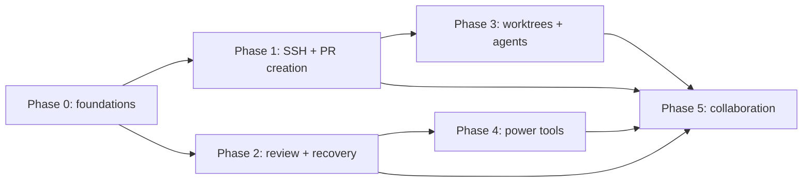

# Multi-Git Feature Roadmap

This directory turns the competitive review into independently executable implementation phases. Each phase is a self-contained handoff for a coding agent, while [FEATURE_PARITY.md](FEATURE_PARITY.md) is the shared inventory and research record.

## Product decisions

- Pull requests use a large in-app creator, with GitHub implemented first through the authenticated `gh` CLI and a provider interface retained for later hosts.
- SSH profiles use the native Windows OpenSSH Authentication Agent. When a selected key is unlocked, Multi-Git starts or repairs the agent when needed and loads that key. Other operating systems receive detection and actionable diagnostics first.
- Worktrees are first-class and can launch configured external coding agents. Multi-Git does not inject proprietary hooks or attempt to monitor live agent sessions.
- Git commands remain argument-array based. Never interpolate untrusted values into a shell command, log secrets, or weaken repository path validation.
- Dependency upgrades target the newest stable releases. If compatibility cannot be restored with reasonable changes, pin the newest compatible release and document the exact blocker and upstream issue.

## Phases

| Phase | Deliverable | Depends on | Parallel work | Status |
| --- | --- | --- | --- | --- |
| [0](phase-0-toolchain-foundations.md) | Latest toolchain, cancellable process runner, schemas and CI foundations | None | Must land first | Complete (2026-08-05) |
| [1](phase-1-ssh-agent-pr-creator.md) | Reliable SSH agent integration and GitHub PR creator | Phase 0 | SSH and PR lanes can split | Complete (2026-08-07) |
| [2](phase-2-review-history-recovery.md) | Precision review, history rewriting, signing and recovery | Phase 0; signing follows Phase 1 SSH | Feature lanes can split | Planned |
| [3](phase-3-worktrees-windows-agents.md) | Worktrees, multi-window workflows and external agent launch | Phase 1 | Can run beside Phase 4 | Planned |
| [4](phase-4-repository-power-tools.md) | Remotes, submodules, LFS, patches, bisect, notes and external tools | Phase 2 recovery primitives | Can run beside Phase 3 | Planned |
| [5](phase-5-collaboration-stacked-work-environments.md) | Multi-provider collaboration, stacked work, WSL and remote environments | Phases 1–4 | Split by provider/environment | Planned |



## Agent execution contract

1. Read this file, [FEATURE_PARITY.md](FEATURE_PARITY.md), and the assigned phase completely.
2. Work from an up-to-date prerequisite branch in a dedicated Git worktree. Suggested branches use `codex/phase-<n>-<slug>`.
3. Run `npm test` and `npm run compile` before editing. Record any pre-existing failure instead of masking it.
4. Claim shared hotspots before changing them: `package*.json`, TypeScript/Vitest configs, shared API/config types, server app wiring, renderer endpoint/store modules, `public/index.html`, and `public/styles.css`.
5. Add migrations for persisted schema changes. Do not silently discard existing settings, repositories, SSH profiles, or Safety Net records.
6. Keep server operations typed, abortable, testable without a real host account, and safe for paths containing spaces or Unicode.
7. Add unit/integration coverage, relevant documentation, and manual acceptance steps. Do not commit generated `out/` or `dist/` artifacts.
8. Use Conventional Commits and hand off with the report below. Do not mark a phase complete while required acceptance criteria remain open.

### Handoff report

```text
Phase / branch:
Status: complete | partial | blocked
Changed files and user-visible behavior:
API, IPC, config, or migration changes:
Automated verification:
Manual verification:
Known risks and follow-ups:
```

## Baseline captured on 2026-08-03

- Repository tests: 283 passed, 3 skipped.
- TypeScript compilation passed under the existing configuration.
- Installed versions were Electron 42.8.0, Vitest 3.2.7, and TypeScript 5.9.3.
- Latest stable versions verified for the plan were Electron 43.2.0, Vitest 4.1.10, and TypeScript 7.0.2.
- A trial with Vitest 4.1.10 and Vite 8.2 passed the suite. TypeScript 7 required modern module settings; the sources compiled with `module: ESNext` and `moduleResolution: bundler`.
- The local Windows `ssh-agent` service was stopped and disabled, `SSH_AUTH_SOCK` was unset, and `ssh-add -l` could not contact an agent. This is the primary Phase 1 reliability case.

## Maintaining the roadmap

Review the competitor request sources quarterly and before planning a major release. Add feature requests, not bug-fix backlogs. Each accepted item must have a target phase or an explicit deferred decision, source link, and acceptance outcome in [FEATURE_PARITY.md](FEATURE_PARITY.md).
